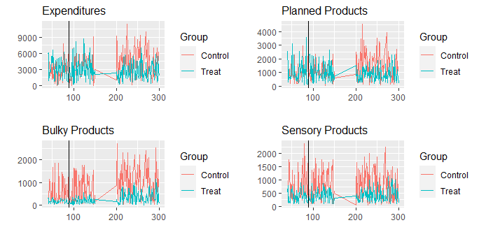

# The Long-Term Effects of Online Channel Adoption in Grocery Retailing: A Research Note

### Author:
Tanetpong (Ned) Choungprayoon, [Emelie Fröberg](linkedin.com/in/emeliefroberg) , [Sara Rosengren](linkedin.com/in/sara-rosengren-sse)

## Abstract:
This study explores the long-term effects of online channel adoption on grocery retailing. Employing the theory of shopping utility maximization, we investigate purchase behaviors of existing customers in categories with different online shopping utility and link them to changes in purchase patterns (shopping frequency and monetary value) and ultimately retailer revenues. Using five-year customer data from a Nordic grocery retailer, we compare (multichannel) customers who adopt an online channel with customers who do not by using propensity score matching and difference-in-differences analysis. The findings show that multichannel customers had their purchasing habits disrupted and this led them to change in the long run; they buy more products in categories with high perceived online ordering convenience and fewer products in categories with high perceived ordering risk. Although they do not change their purchase frequency, the monetary value (per visit) increases, leading to higher total expenditure and thus long-term revenue to the retailer. Our research contributes to the existing literature, which has focused on the short-term effects of online adoption in the grocery context by empirically showing the long-term effects on the category level, customer level, and retailer level, and by providing a systematic bottom-up framework for the retailer to study the effects of customer adoption over time.

## Overview
The purpose of this repository is to publish the empirical research project conducted as part of my doctoral dissertation and to make the analysis part (with R) accessible, potentially inspiring further study. [The slides related to this study](https://github.com/tanetpongc/channeladoption/blob/main/slide_deck/Slides_channeladoption.pdf) are also available in this repository. The empirical data is obtained from the retailer and stored via **AWS** and retrieve using (Postgre) **SQL**. This project is supported by Torsten Söderbergs Stiftelse and Håkon Swensons Stiftelsen.

`slide_deck` contains the most updated slides

`data` contains *df.csv* which is simulated data, similar to our data structure, used for the walkthrough and *Simulate_Data.R* illustrating how data is simulated

`analysis` contains R code used for analyzing

`img` contains visualization used in the walkthrough


## Walkthrough with simulated data
### Required package
For this project, we mainly use `dplyr` for data aggregation, as we later need to substract across dataset, hence `dplyr` is more convenient and  `MatchIt` for comparable matching between multichannel shopper offline shopper.

<details>
  <summary>Load required package</summary>

```R
library(data.table) 
library(dplyr) 
library(ggplot2)
library(gridExtra) 
library(MatchIt)
```
</details>

### The data
**Setting**: We simulated 15 customers shopping across channels (offline and online). Ten customers are multichannel shoppers and five customers are offline shoppers. We combined two dataset; the first dataset from week $40^{th}$ to $150^{th}$ and the second dataset from week $200^{th}$ to $300^{th}$. The online channel is introduced in week 90.
<details>
  <summary>Import data</summary>

```R
df <- fread("../data/df.csv")
```
</details>

| Variable        | Description                                                  |
|---------------|------------------------------------------------------------|
| cust    | Customer id                                 |
| week_nr| Week number |
| spend | Total money spent                   |
| online | = 1 if customer makes purchase online, otherwise 0              |
| postal | Customer's postal code (10000 close to the store,)                     |
| volume | Total number of products purchased                              |
| plannedvol |Total number of products purchased from high perceived online ordering convenience categories |
| bulkyvol| Total number of products purchased from high perceived online delivery convenience categories |
| sensoryvol| Total number of products purchased from high perceived online ordering risk categories |
| plannedspend |Total money spent on high perceived online ordering convenience categories |
| bulkyspend| Total money spent on high perceived online delivery convenience categories |
| sensoryspend| Total money spent on high perceived online ordering risk categories |
| nr_product | Total number of unique product (SKU) purchased             |
| nr_product_deal | Total number of unique product (SKU) purchased on deal                    |
| diapers  | Total number of unique product (SKU) purchased on deal                    |

### Model-free Evidence
We compare customer purchasing behaviors pre and post the online channel introduction.
<details>
  <summary>Mean comparisons across customer between pre and post introduction </summary>

```R
cutoff = 90


df.sumstat = df %>%
  filter(week_nr < cutoff) %>%
  group_by (cust) %>%
  summarise(first.w = min(week_nr),
            monetary = mean(spend),
            visits = n(),
            postal = max(postal),
            volume = sum(volume),
            deals = mean(nr_product_deal/volume),
            diapers = sum(diapers, na.rm = T)
  ) %>%
  mutate(frequency = visits/52#
  )

df.sumstat$distclose = ifelse(
  df.sumstat$postal %in% c(10000),1,ifelse(is.na(df.sumstat$postal),NA,0))

sumstat = t(df.sumstat %>% 
              summarise (
                Frequency = c(mean(frequency), sd(frequency)),
                Monetary = c(mean(monetary), sd(monetary)),
                Distant = c(mean(distclose, na.rm = T), sd(distclose, na.rm = T)),
                Volume = c(mean(volume), sd(volume)),
                Deals = c(mean(deals*100), sd(deals*100)),
                Diaper = c(mean(diapers), sd(diapers)),
                N = n()
              ))
```
</details>

|               | Pre            | Post          |
|---------------|---------------|--------------|
| Frequency     | 0.33     | 0.55|
| Monetary      | 1219  | 929 |
| Distant       | 0.53    | 0.52 |
| Volume        | 1852  | 2362 |
| Deals         | 0.50    | 0.55 |
| Diaper        | 18   | 14 |
| N             | 15    | 15 |

We assign treatment group (customers who use online channel) and control group (customers who never use online channel) and compare (We have missing data from week $150^{th}$ to $200^{th}$)

<details>
  <summary>Multichannel shopper and offline shopper comparison over time</summary>

```R
#Assign Treatment group
  df$cust = as.factor(factor(df$cust))
  df.treatment = df %>% group_by(cust) %>% summarise (treatment = max(online))
  sum(df.treatment$treatment)
  #147
  df = merge(df, df.treatment, by = "cust", all.X = T)
  #replace NA with 0


## First, parallel trend
df.trend <- df %>% group_by(week_nr, treatment) %>%
  summarize_at(
    c("spend", 
      "plannedspend",  
      "bulkyspend",
      "sensoryspend",
      "volume",
      "plannedvol",  
      "bulkyvol",
      "sensoryvol"
    ), "sum", na.rm = TRUE)
##provide levels
df.trend$treatment <- as.factor(
  ifelse(df.trend$treatment == 1, "Treat", "Control"))
plot.trend = function(dv, dv.title){ 
  p = ggplot(df.trend, 
             aes(x=week_nr, 
                 y={{dv}}, 
                 group=treatment, 
                 colour=treatment)) +
    geom_line() + geom_vline(xintercept = cutoff) + 
    labs(
      x = "", y = "", title = dv.title, colour = "Group") + 
    theme(plot.title = element_text(size=12))
  return(p)
}

#This is sum
p.spend = plot.trend(
  dv = spend, 
  dv.title = "Expenditures")
p.plannedspend = plot.trend(
  dv = plannedspend, 
  dv.title = "Planned Products")
p.bulkyspend = plot.trend(
  dv = bulkyspend, 
  dv.title = "Bulky Products")
p.sensoryspend = plot.trend(
  dv = sensoryspend, 
  dv.title = "Sensory Products")
grid.arrange(p.spend, p.plannedspend, 
             p.bulkyspend, p.sensoryspend,
             nrow=2, ncol=2)
rm(list = c("p.bulkyspend", 
            "p.plannedspend", 
            "p.sensoryspend", 
            "p.spend"
))
```
</details>


<figure><figcaption></figcaption></figure>

However, customers tend to self-select to the online channel, it may be that customers who adopt the online channel are genuinely different from those who do not, regardless of online channel adoption (e.g. they generally buy more). To deal with this issue, we employ propensity score matching to match multichannel customers with offline customers who are similar to them prior to channel adoption. We hope the trend prior channel adoption become more similar and comparable.
<details>
  <summary>Pool data for matching</summary>

```R
#Add groups
df = df %>% mutate(
  long = case_when(
    week_nr >= 40 & week_nr < cutoff ~ "pre",
    week_nr >= cutoff & week_nr < 151 ~ "short",
    week_nr >= 200 & week_nr < 301 ~ "long"
  )
)
cols = c("plannedspend", 
         "bulkyspend", 
         "sensoryspend",
         "frequency",
         "monetary",
         "spend",
         "plannedvol", 
         "bulkyvol", 
         "sensoryvol",
         "volume")

df.week.control = df %>% 
  filter (treatment == 0) %>%
  group_by (long, cust) %>% 
  summarise(
    plannedspend = ifelse(is.na(sum(plannedspend)),0, sum(plannedspend)), 
    bulkyspend = ifelse(is.na(sum(bulkyspend)),0, sum(bulkyspend)),
    sensoryspend=  ifelse(is.na(sum(sensoryspend)),0, sum(sensoryspend)),
    monetary = mean(spend),
    spend = sum(spend),
    plannedvol = ifelse(is.na(sum(plannedvol)),0, sum(plannedvol)),
    bulkyvol = ifelse(is.na(sum(bulkyvol)),0, sum(bulkyvol)),
    sensoryvol = ifelse(is.na(sum(sensoryvol)),0, sum(sensoryvol)),
    volume = sum(volume),
    first.w = min(week_nr), 
    last.w = max(week_nr), 
    visits = n(),
    frequency = visits/52#(last.w-first.w) 
  ) 
df.week.control$cust = factor(df.week.control$cust)


df.week.treat = df %>% 
  filter(TRUE) %>% 
  filter (treatment == 1) %>%
  group_by (long, cust) %>% 
  summarise(
    plannedspend = ifelse(is.na(sum(plannedspend)),0, sum(plannedspend)), 
    bulkyspend = ifelse(is.na(sum(bulkyspend)),0, sum(bulkyspend)),
    sensoryspend=  ifelse(is.na(sum(sensoryspend)),0, sum(sensoryspend)),
    monetary = mean(spend),
    spend = sum(spend),
    plannedvol = ifelse(is.na(sum(plannedvol)),0, sum(plannedvol)),
    bulkyvol = ifelse(is.na(sum(bulkyvol)),0, sum(bulkyvol)),
    sensoryvol = ifelse(is.na(sum(sensoryvol)),0, sum(sensoryvol)),
    volume = sum(volume),
    first.w = min(week_nr), 
    last.w = max(week_nr), 
    visits = n(),
    frequency = visits/52#(last.w-first.w) 
  ) 

df.week.treat$cust = factor(df.week.treat$cust)

df.week = rbind(
  data.frame(df.week.control, treatment = 0),
  data.frame(df.week.treat, treatment = 1)
)
```
</details>

We employ propensity score matching:
<figure><figcaption></figcaption></figure>

*Note for this simulated dataset, we only match with respect to monetary, frequency and diapers*

<details>
  <summary>Matching using PSM</summary>

```R
#Add groups
  
  df.before = df %>% filter(week_nr < cutoff & week_nr >= cutoff-52)
  # calculate all measures per customer
  df.before = df.before %>% 
    group_by (cust) %>% 
    summarise(last.w = max(week_nr), 
              first.w = min(week_nr), 
              monetary = mean(spend), 
              visits = n(), 
              postal = max(postal),
              volume = sum(volume), 
              dealproneness = mean(nr_product_deal/nr_product),
              deals = mean(nr_product_deal/volume),
              treatment = max(treatment),
              diapers = sum(diapers, na.rm = T),
              recency = cutoff - last.w, 
              frequency = visits/52
    )
  #Recode postal code
  #distclose is 1 if postal code == 10000
  df.before$distclose = ifelse(
    df.before$postal %in% c(10000), 1, ifelse(is.na(df.before$postal), NA, 0))
  
  df.before.sub = select(df.before, 
                         treatment,
                         frequency,
                         monetary,
                         distclose,
                         diapers,
                         cust,
                         volume,
                         deals)
  df.before.sub <- data.frame(na.omit(df.before.sub))
  
  
  #PSM 
  df.matchit = matchit(
    treatment ~ monetary + frequency + diapers, 
    data = df.before.sub
  )
  
  df.matchit
  plot(df.matchit)

# create dataset with matched pairs, including first online date per matched pair
# and wid, to denote within-identifier
{
  cust.treated = data.frame(cust = df.before.sub[(row.names(df.matchit$match.matrix)),"cust"], treatment = "Treat")
  first_online = df %>% filter(online == 1) %>% group_by(cust) %>% summarise(first_online = min(week_nr))
  cust.treated = cust.treated %>% left_join(first_online, by = "cust")
  cust.control = data.frame(cust = df.before.sub[(df.matchit$match.matrix),"cust"],
                            treatment = "Control", first_online = cust.treated$first_online, wid = cust.treated$cust)
  
  #remove the discarded case:
  cust.treated$cust = factor(cust.treated$cust)
  cust.control = cust.control[!is.na(cust.control$cust),]
  cust.control$cust = factor(cust.control$cust)
  
}

df.matched = rbind(data.frame(cust.treated, wid = cust.treated$cust), cust.control)
df.matched = df.matched %>% 
  full_join(df, by = "cust") 

#periods based on first purchase (matched)
df.matched = df.matched %>% 
  filter(!is.na(treatment.x)) %>%
  mutate( 
    long = case_when(
      week_nr >= 40 & week_nr < cutoff ~ "pre",
      week_nr >= cutoff & week_nr < 151 ~ "short",
      week_nr >= 200 & week_nr < 301 ~ "long"
    ))
df.matched = df.matched[!is.na(df.matched$long),]

## New visual inspection of parallel trend
df.trend <- df.matched %>% group_by(week_nr, treatment.y) %>%
  summarize_at(
    c("spend", 
      "plannedspend",  
      "bulkyspend",
      "sensoryspend",
      "volume",
      "plannedvol",  
      "bulkyvol",
      "sensoryvol"
    ), "sum", na.rm = TRUE)
##provide levels
df.trend$treatment <- as.factor(
  ifelse(df.trend$treatment.y == 1, "Treat", "Control"))
p.spend = plot.trend(
  dv = spend, 
  dv.title = "Expenditures")
p.plannedspend = plot.trend(
  dv = plannedspend, 
  dv.title = "Planned Products")
p.bulkyspend = plot.trend(
  dv = bulkyspend, 
  dv.title = "Bulky Products")
p.sensoryspend = plot.trend(
  dv = sensoryspend, 
  dv.title = "Sensory Products")
grid.arrange(p.spend, p.plannedspend, 
             p.bulkyspend, p.sensoryspend,
             nrow=2, ncol=2)
rm(list = c("p.bulkyspend", 
            "p.plannedspend", 
            "p.sensoryspend", 
            "p.spend"
))
```
</details>

<figure><figcaption></figcaption></figure>

* The the purchase behaviors between treatment group (multichannel customers) and control group (online customers) becomes more comparable now (Expenditures, Planned Products and Sensory Products are similar in trend)

### DiD Estimation

We estimate a difference in all our variables of interest between the matched pairs

<figure><figcaption></figcaption></figure>


where $Y_{i,t}$ is the difference between the matched pair \( i \) in period \( t \) of the purchase behaviors (Planning, Heavy/Bulky, Sensory, Frequency, Monetary Value, and Expenditures)

<details>
  <summary>DiD Estimation</summary>

```R
#regression tests
cols = c("plannedspend", "bulkyspend", "sensoryspend", "frequency", "monetary", "spend")

#Use swith for panels
df.long = df.matched %>% 
  filter(TRUE) %>% #PANEL A
  #filter (!(treatment.y == 1 & long != "pre" & online == 0)) %>% #PANEL B
  #filter (online == 0) %>% #PANEL C
  group_by (cust, long) %>% 
  summarise(last.w = max(week_nr), 
            first.w = min(week_nr), 
            monetary = mean(spend), 
            visits = n(), 
            postal = max(postal),
            volume = sum(volume), 
            deals = mean(nr_product_deal/volume),
            diapers = sum(diapers, na.rm = T),
            wid = first(wid),
            treat = max(treatment.x),
            plannedspend= sum(plannedspend, na.rm = T),
            bulkyspend = sum(bulkyspend, na.rm = T),
            sensoryspend = sum(sensoryspend, na.rm = T),
            spend = sum(spend, na.rm = T),
            frequency = visits/52#(cutoff-first.w)
  ) 

df.long$distclose = ifelse(
  df.long$postal %in% c(10000), 1,ifelse(is.na(df.long$postal), NA, 0))

df.long = na.omit(select(df.long, 
                         -first.w, 
                         -visits, 
                         -postal, 
                         -last.w))

df.long = df.long[!is.na(df.long$wid),]
df.long$wid = factor(df.long$wid)
df.long$long = factor(df.long$long)
df.long.diff = df.long %>% 
  filter (treat == "Treat") %>%
  full_join (
    df.long %>% 
      filter (treat == "Control"),
    by = c("wid", "long")
  )
df.long.diff = select(df.long.diff, -cust.x, -cust.y)
df.long.diff$treat.x = "Treat"
df.long.diff$treat.y = "Control"
##replace NA with 0
df.long.diff[is.na(df.long.diff)] <- 0

#substract
df.long.diff.reg = select(
  df.long.diff,
  volume.x,
  deals.x,
  diapers.x,
  plannedspend.x,
  bulkyspend.x,
  sensoryspend.x,
  frequency.x,
  monetary.x,
  spend.x) - 
  select(
    df.long.diff,
    volume.y,
    deals.y,
    diapers.y,
    plannedspend.y,
    bulkyspend.y,
    sensoryspend.y,
    frequency.y,
    monetary.y,
    spend.y
  )

df.long.diff.reg = cbind(df.long.diff$long, df.long.diff.reg)
names(df.long.diff.reg) = c("long", "volume", "deals", "diapers",
                            cols)

reg = as.data.frame(matrix(NA, nrow = 4, ncol = 6))
df.long.diff.reg$long <- as.factor(df.long.diff.reg$long)
formulas = paste(cols,"long+volume+deals+diapers", sep = "~")
df.long.diff.reg$long = relevel(df.long.diff.reg$long, ref="pre")

for(i in 1:length(formulas)){
  fit = summary(lm(formulas[i], df.long.diff.reg))
  reg[1,i] = paste(
    round(
      fit$coefficients[[1]],
      2),
    paste("(",round(
      fit$coefficients[[1,2]], #SE
      2),")", sep = ""),
    sep = " ")
  reg[2,i] = paste(
    round(
      fit$coefficients[[2]],
      2),
    paste("(",round(
      fit$coefficients[[2,2]], #SE
      2),")", sep = ""),
    sep = " ")
  reg[3,i] = paste(
    round(
      fit$coefficients[[3]],
      2),
    paste("(",round(
      fit$coefficients[[3,2]], #SE
      2),")", sep = ""),
    sep = " ")
  reg[4,i] = round(
    fit$r.squared,
    2)
}
```
</details>

|      | plannedspend               | bulkyspend               | sensoryspend              | frequency         | monetary               | spend               |
|------|-------------------|-------------------|------------------|------------|-------------------|------------------|
| Short    |-3922.08 (6770.76) | -6208.33 (4940.54) | -5332.54 (5847.92) | -0.08 (0.05) | -108.41 (310.24) | -5623.13 (11602.15) |
| Long    | 	-8410.46 (9086.66) | -7355.19 (6630.42) | -1524.76 (7848.16) | 0.08 (0.07) | -706.2 (416.36)  | -27943.8 (15570.59) |
| R-squared    | 0.49              | 0.46               | 0.28              | 0.66       | 0.78              | 0.73              |

* For this simulated dataset,significant negative (short-run) effect on **frequency**	implying customers visit this retailer less after adopting online channel
* For this simulated dataset,significant negative (long-run) effect on **spend** implying customers spend less after adopting online channel in the long run